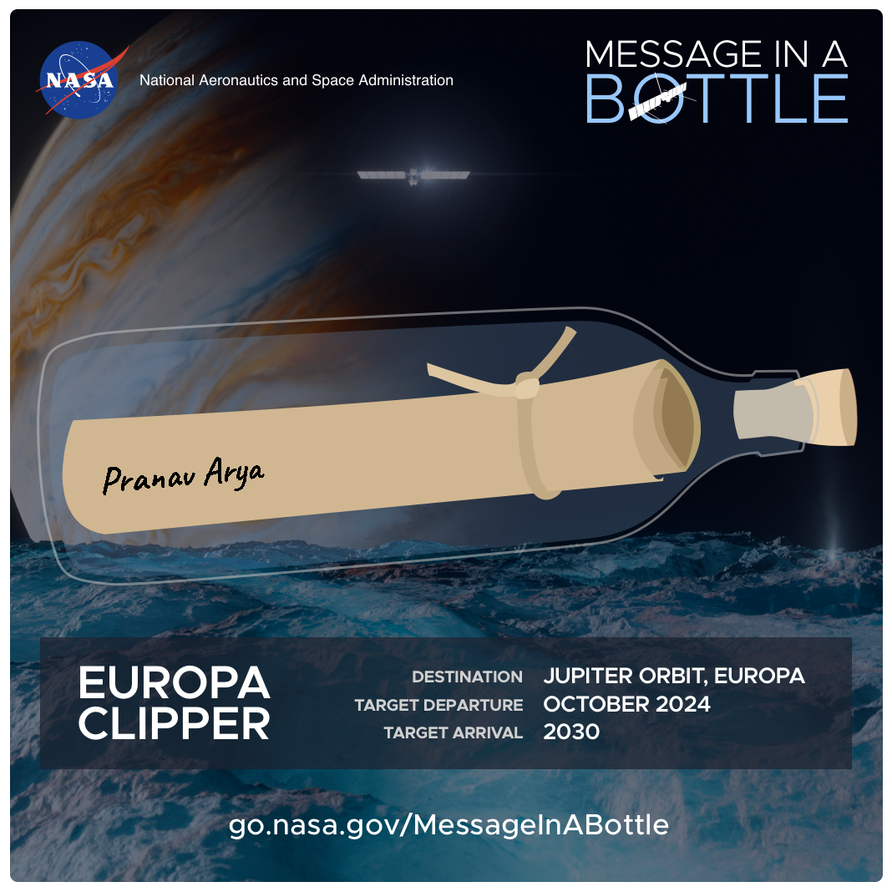
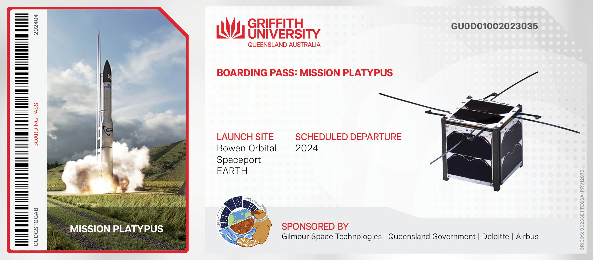
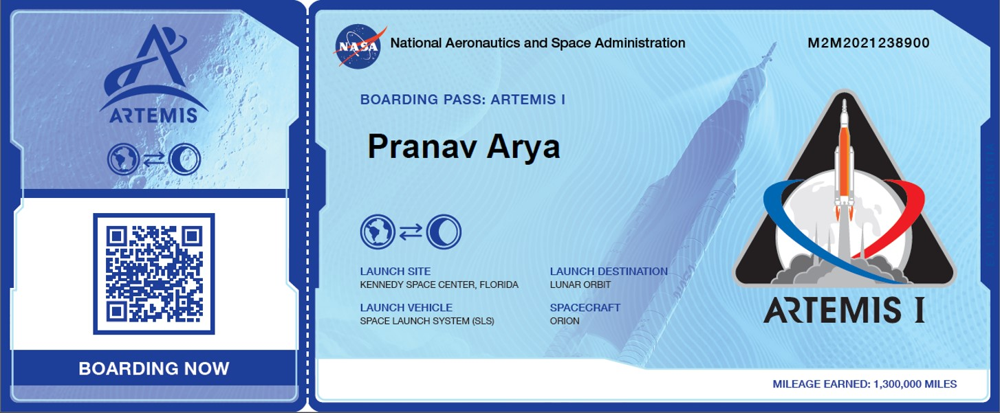

# My-Name-In-Space

- ### Future Mars Mission

***
- ### Future Mars Mission Updated

***
- ### Europa Clipper - Jupiter's moon

***
- ### Mission Platypus - Griffith University, Australia

***
- ### Xplore to the Moon

***
- ### Viper (The Rover), Artemis (The Program)

***
- ### Orion (The Spacecraft), Artemis 1 (The Mission)

***
- ### Mars 2020 Mission

***
- ### Parker Solar Probe

<a href="https://github.com/PranavArya37/My-Name-In-Space/blob/d5ba7ce48161ab6492e37d05d4f83fd89a8da314/Parker%20Solar%20Probe.pdf" target="_blank">Click Here to See PDF for Parker Solar Probe</a>

***

- ### dearMoon

***

- ### Frequent Flyer Club (Mars)

***

- ### Mars 2020 Mission Patch

